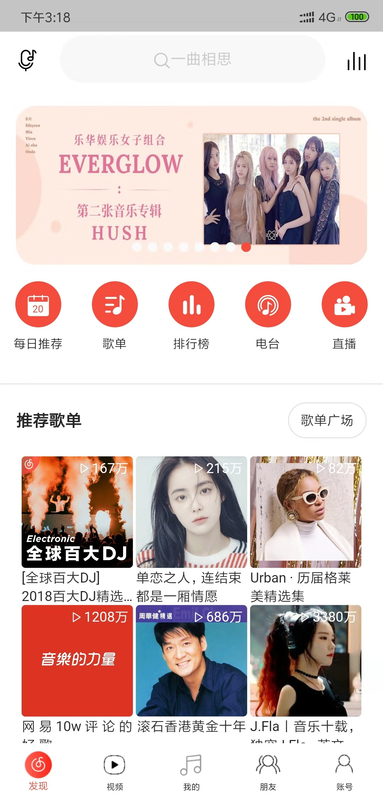
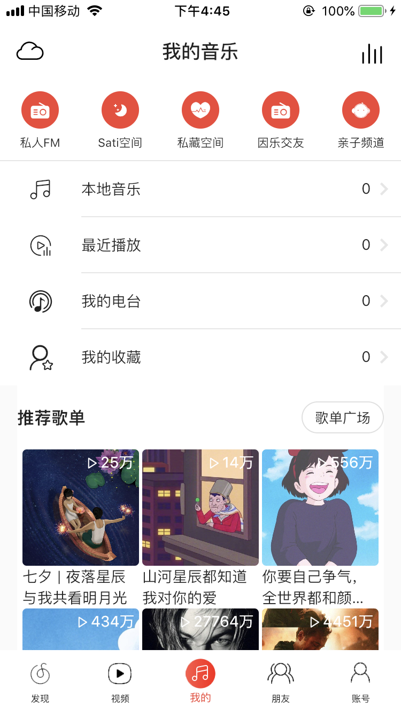
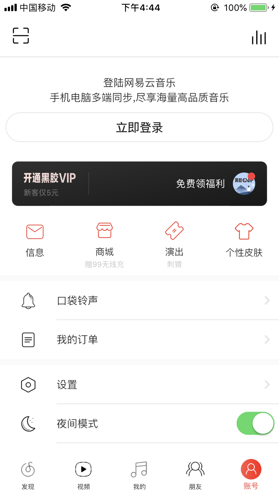

# flutter_netease_cloud_music

利用 flutter 高仿网易云音乐 IOS 版本

## 目前进度

- [x] 首页布局界面以及接口初略完成大部分
- [x] 首页保持状态完成
- [x] 底部导航栏静态组件结合状态管理完成
- [x] 启动页完成
- [x] 账户界面完成
- [x] 推荐歌单列表页主体界面完成
- [ ] 歌曲播放界面
- [ ] 每日推荐界面
- [ ] 歌曲播放界面
- [ ] 歌单广场
- [ ] 歌曲播放界面
- [ ] 排行榜
- [ ] 歌曲播放界面
- [ ] 主播电台
- [ ] 听歌识曲
- [ ] 登录
- [ ] 添加关注

|                      发现界面                      |                     我的界面                     |                      账号界面                       |
| :------------------------------------------------: | :----------------------------------------------: | :-------------------------------------------------: |
|  |  |  |

> ## 发现页面

> ## 我的界面

> ## 账号界面

> ## 推荐歌单列表

安装包版本下载

### android v0.1.0

[v0.1.0 apk 文件下载](https://github.com/UvDream/flutter_netease_cloud_music/releases/download/v0.1.0/app-release.apk "v0.1.0")

Flutter QQ 交流群(167646174)

Flutter 微信交流群

